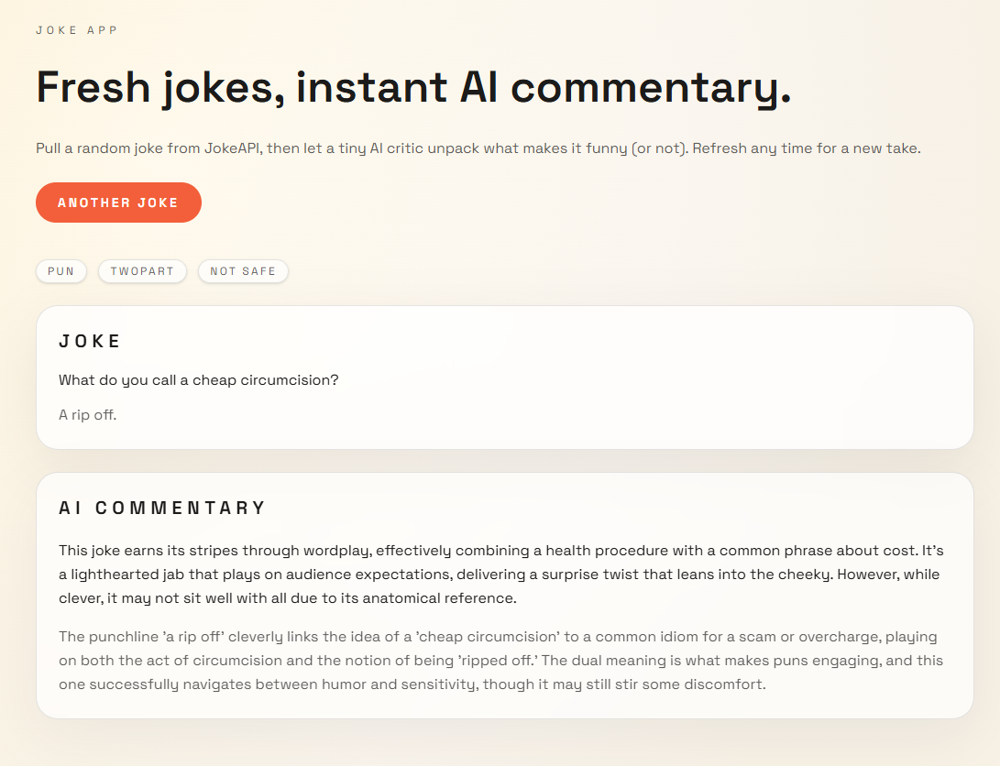

## Joke App


### Introduction

Joke App is a single-page Next.js app that fetches random jokes from JokeAPI and adds a short AI comment plus explanation for each joke.




### Technologies
- Next.js 16.1.6
- AI SDK (+ OpenRouter Integration)
- JokeAPI (fetch)

### Usage
```bash
bun install
bun run dev 
# or 
bun run build 
bun run start
```

*AI Generated Readme*
